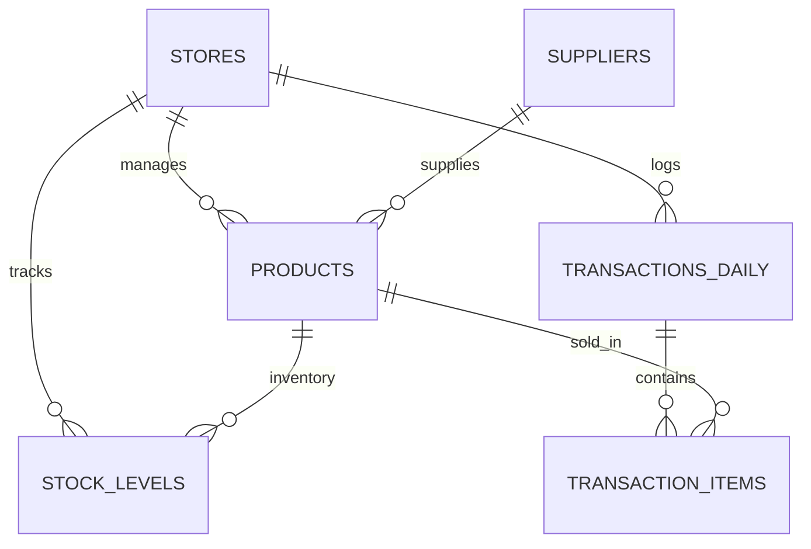

# RetailAI Backend Architecture & API Specification

This document details the database schemas, REST API endpoints, authentication flows, and Machine Learning forecasting service requirements required to construct the backend for the RetailAI console.

---

## 1. Relational Database Schema Design



### 1.1 `stores` Entity
Stores information regarding active retail store outlets.
- `id` (VARCHAR, Primary Key) - unique identifier (e.g., `balaji-store`, `store-101`)
- `name` (VARCHAR) - Name of the store (e.g., "Balaji Store")
- `type` (ENUM) - `Small` | `Medium` | `Supermarket`
- `location` (ENUM) - `Urban` | `Semi-Urban` | `Rural`
- `investment` (DECIMAL) - Initial capital setup investment amount
- `opening_month` (VARCHAR) - Month of establishment
- `months_active` (INT) - Months store has been operational

### 1.2 `products` Entity
Master catalog list of products available.
- `id` (VARCHAR, Primary Key) - Product identifier (e.g., `IG-RICE-1KG`)
- `name` (VARCHAR) - Product name
- `sku` (VARCHAR, Unique) - Stock Keeping Unit barcode code
- `category` (VARCHAR) - Category group (e.g., "Staples & Grains")
- `brand` (VARCHAR) - Product brand (e.g., "India Gate")
- `cost_price` (DECIMAL) - Purchase cost from vendor
- `selling_price` (DECIMAL) - Retail shelf price
- `supplier_id` (VARCHAR, Foreign Key -> `suppliers.id`)

### 1.3 `suppliers` Entity
Wholesale suppliers who fulfill stock replenishments.
- `id` (VARCHAR, Primary Key) - Supplier identifier (e.g., `balaji-agro`)
- `name` (VARCHAR) - Company name
- `category` (VARCHAR) - Primary category line (e.g., "Beverages")
- `lead_time_days` (INT) - Days required to deliver orders
- `min_order_qty` (INT) - Minimum order volume threshold

### 1.4 `transactions_daily` Entity
Aggregated daily sales ledger records.
- `id` (VARCHAR, Primary Key) - Unique log ID
- `store_id` (VARCHAR, Foreign Key -> `stores.id`)
- `date` (DATE) - Calendar date of business operation
- `transaction_count` (INT) - Total bills generated
- `gross_sales` (DECIMAL) - Total sales revenue before discounts
- `discount_amount` (DECIMAL) - Combined markdowns applied
- `net_sales` (DECIMAL) - Final payable turnover
- `payment_cash` (DECIMAL) - Cash transaction value
- `payment_upi` (DECIMAL) - UPI transaction value
- `payment_card` (DECIMAL) - Card transaction value
- `audit_status` (VARCHAR) - `Synced & Closed` | `Draft`

### 1.5 `stock_levels` Entity
Real-time stock ledger matching products to store nodes.
- `store_id` (VARCHAR, Foreign Key -> `stores.id`)
- `product_id` (VARCHAR, Foreign Key -> `products.id`)
- `current_stock` (INT) - Quantity on shelf
- `safety_stock` (INT) - Calculated buffer threshold
- `reorder_point` (INT) - Stock level triggering buy order

---

## 2. API Endpoint Specifications

### 2.1 Store Console Authentication
- **Endpoint**: `POST /api/auth/login`
- **Request Payload**:
  ```json
  {
    "username": "Store #101",
    "password": "user_password_here"
  }
  ```
- **Response Payload (200 OK)**:
  ```json
  {
    "token": "JWT_TOKEN_STRING",
    "store": {
      "id": "balaji-store",
      "name": "Balaji Store",
      "type": "Supermarket",
      "location": "Urban",
      "investment": 850000,
      "openingMonth": "October",
      "monthsActive": 9,
      "metrics": {
        "forecastR2": 0.932,
        "wasteMargin": 0.024,
        "stockouts": 2,
        "deficitCount": 3
      }
    }
  }
  ```

### 2.2 Submit Daily Sales Log
- **Endpoint**: `POST /api/stores/:storeId/daily-log`
- **Request Payload**:
  ```json
  {
    "date": "2026-05-17",
    "businessType": "Supermarket",
    "sourceTag": "POS System",
    "paymentDetails": {
      "cash": 12450.00,
      "upi": 9000.50,
      "card": 2995.00
    },
    "items": [
      { "productId": "IG-RICE-1KG", "qty": 12, "discount": 50.00 },
      { "productId": "AMUL-MILK-1L", "qty": 40, "discount": 0.00 }
    ],
    "notes": "Evening rush hour increase."
  }
  ```
- **Response Payload (201 Created)**:
  ```json
  {
    "success": true,
    "logId": "LOG-17893102",
    "netSales": 23445.50
  }
  ```

### 2.3 Retrieve Products Catalog (with Filter/Search)
- **Endpoint**: `GET /api/stores/:storeId/products`
- **Query Params**: `search=Tata`, `category=Beverages`, `page=1`, `limit=10`
- **Response Payload (200 OK)**:
  ```json
  {
    "products": [
      {
        "id": "tata-tea-250",
        "name": "Tata Tea Premium 250g",
        "sku": "TATA-TEA-250",
        "category": "Beverages",
        "stock": 142,
        "cost": 85.00,
        "price": 110.00,
        "margin": 22.7,
        "status": "Healthy"
      }
    ],
    "pagination": { "totalItems": 15, "pages": 2, "currentPage": 1 }
  }
  ```

### 2.4 Place Purchase Orders (Consolidated Order)
- **Endpoint**: `POST /api/inventory/orders`
- **Request Payload**:
  ```json
  {
    "storeId": "balaji-store",
    "items": [
      { "productId": "IG-RICE-1KG", "orderQty": 50 },
      { "productId": "AMUL-MILK-1L", "orderQty": 200 }
    ]
  }
  ```
- **Response Payload (200 OK)**:
  ```json
  {
    "orderId": "PO-1783021",
    "status": "dispatched",
    "estimatedDelivery": "2026-05-20"
  }
  ```

### 2.5 Wizard Onboarding & Store Registration
- **Endpoint**: `POST /api/stores/register`
- **Request Payload**:
  ```json
  {
    "storeName": "Annapoorna Hypermarket",
    "storeType": "Supermarket",
    "locationType": "Urban",
    "openingMonth": "October",
    "investment": "850000",
    "productsList": [
      { "name": "Aashirvaad Chakki Atta 5kg", "qty": 120, "buyingPrice": 245.0, "sellingPrice": 280.0 },
      { "name": "Amul Salted Butter 100g", "qty": 200, "buyingPrice": 56.0, "sellingPrice": 68.0 }
    ],
    "supplier": {
      "name": "Balaji Agro Distributors",
      "phone": "+91 98765 43210",
      "email": "contact@balajiagro.com"
    }
  }
  ```
- **Response Payload (201 Created)**:
  ```json
  {
    "success": true,
    "storeId": "annapoorna-hypermarket",
    "message": "Store successfully registered and inventory initialized."
  }
  ```

### 2.6 Suggested Wholesale Suppliers Directory
- **Endpoint**: `GET /api/suppliers/suggestions`
- **Query Params**: `storeType=Supermarket`, `location=Urban`
- **Response Payload (200 OK)**:
  ```json
  [
    { "id": "sup-1", "name": "Balaji Agro Distributors", "category": "Staples & Grains", "reliability": "98.5%", "location": "Chennai HQ", "phone": "+91 98765 43210" },
    { "id": "sup-2", "name": "Surya Packaged Goods Ltd", "category": "Beverages", "reliability": "96.8%", "location": "Bangalore", "phone": "+91 87654 32109" }
  ]
  ```

### 2.7 Parse Custom Product Purchase Plan (CSV/XLSX)
- **Endpoint**: `POST /api/catalog/parse-plan`
- **Request Payload**: `multipart/form-data` (CSV/XLSX file)
- **Response Payload (200 OK)**:
  ```json
  {
    "itemsCount": 4,
    "products": [
      { "id": 201, "name": "Premium Kolam Rice 10kg", "category": "Staples & Grains", "buyingPrice": 580.0, "sellingPrice": 650.0, "qty": 100, "checked": true },
      { "id": 202, "name": "Madhur Pure Sugar 5kg", "category": "Staples & Grains", "buyingPrice": 210.0, "sellingPrice": 240.0, "qty": 150, "checked": true }
    ]
  }
  ```

### 2.8 Operations & System Management APIs
- **Retrieve Store Inventory**: `GET /api/stores/:storeId/inventory`
  *   Returns: SKU stock list, safety margins, and computed Reorder Point (ROP).
- **Consolidated Inventory Shortages**: `GET /api/inventory/bulk-consolidation`
  *   Returns: Aggregated low-stock products across all store formats to draft a consolidated wholesale order.
- **Dispatch Bulk Purchase Order**: `POST /api/inventory/bulk-consolidation/orders`
  *   Payload: `[{ name: string, qty: number, cost: number }]`
- **Retrieve Store Financial Blueprint**: `GET /api/stores/:storeId/financials`
  *   Returns: Category budget allocations, locked capital statistics, net profit estimation, and average ROI metrics.
- **Retrieve Ingested Demand Signal**: `GET /api/stores/:storeId/forecast`
  *   Returns: Daily actual vs adjusted baseline demand signals, upcoming holiday weights, and format constraints.
- **Retrieve Starting Recommendations**: `GET /api/stores/:storeId/recommendations`
  *   Returns: Suggested starter SKU catalogs matching investment brackets.
- **Retrieve Latest Health Report**: `GET /api/stores/:storeId/reports/latest`
  *   Returns: Structured summary logs of business metrics, warning indicators, and category suggestions.
- **Historical Sales Logs Ledger**: `GET /api/stores/:storeId/daily-logs`
  *   Returns: Paginated historical ledger entries with UPI/UPI/Card distributions.
- **Update User Profile**: `PUT /api/users/profile`
  *   Payload: `name`, `email`, `phone`
- **Update User Password**: `PUT /api/users/password`
  *   Payload: `currentPassword`, `newPassword`
- **Trigger Database Backup**: `POST /api/stores/:storeId/backup`
  *   Returns: Timestamp of backup creation.
- **Download Backup Preferences JSON**: `GET /api/stores/:storeId/backup/download`
  *   Returns: Retail console backup setup configurations as a JSON file.
- **Reset Store Data**: `POST /api/stores/:storeId/reset`
  *   Clears: Ingested daily sales logs and resets inventory back to baseline values.
- **Deactivate/Delete Store Console**: `DELETE /api/stores/:storeId`
  *   Clears: Account registrations and logs operator profiles out of the platform.

---

## 3. Machine Learning Forecasting Integration

This endpoint runs the prediction algorithms using the historical transaction records.

- **Endpoint**: `POST /api/stores/:storeId/predictions/forecast`
- **Algorithm Objective**: Calculate the sales demand path for the next 30 days (4-week segments) using regression.
- **Response Payload (200 OK)**:
  ```json
  {
    "summary": {
      "projectedRevenue": 945230.50,
      "projectedUnitsDemand": 5842,
      "confidenceMetricR2": 0.948
    },
    "weeklyBreakdown": [
      { "week": "Week 1", "projectedSales": 210000.00 },
      { "week": "Week 2", "projectedSales": 235000.00 },
      { "week": "Week 3", "projectedSales": 248000.00 },
      { "week": "Week 4", "projectedSales": 252230.50 }
    ]
  }
  ```
